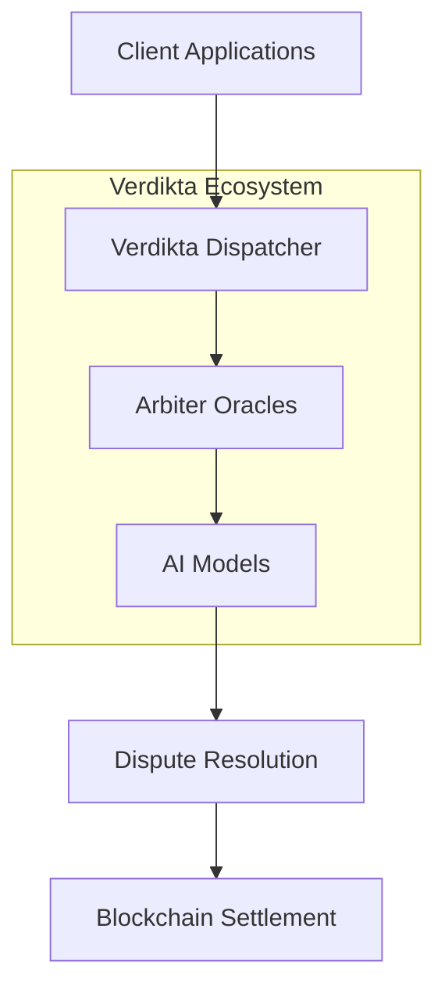

# Verdikta Documentation

Welcome to the comprehensive documentation for the Verdikta ecosystem - a decentralized AI-powered dispute resolution platform built on blockchain technology.

## What is Verdikta?

Verdikta is a decentralized oracle system that provides AI-powered dispute resolution services on blockchain networks. Our ecosystem combines advanced AI models with blockchain infrastructure to deliver fair, transparent, and efficient arbitration services.

## Quick Navigation

-   :fontawesome-solid-rocket:{ .lg .middle } **Node Operators**

    ---

    Set up and manage Verdikta Arbiter Nodes for dispute resolution

    [:octicons-arrow-right-24: Node Setup Guide](verdikta-arbiter-node-installation-guide/)

-   :fontawesome-solid-code:{ .lg .middle } **Developers**

    ---

    Build applications using Verdikta's APIs and SDKs

    [:octicons-arrow-right-24: Developer Guide](apps/)

-   :fontawesome-solid-file-contract:{ .lg .middle } **Smart Contracts**

    ---

    Integrate with Verdikta's on-chain components

    [:octicons-arrow-right-24: Contract Docs](verdikta-dispatcher-smart-contracts/)

-   :fontawesome-solid-puzzle-piece:{ .lg .middle } **Integrations**

    ---

    Common utilities and integration patterns

    [:octicons-arrow-right-24: Integration Guide](verdikta-common/)

## Architecture Overview

## Getting Started

Choose your path based on your role:

- **Node Operators**: Start with [Prerequisites](verdikta-arbiter-node-installation-guide/prerequisites/) then follow our [Quick Start Guide](verdikta-arbiter-node-installation-guide/quick-start/)
- **Developers**: Jump into our [Developer Quick Start](apps/)
- **Smart Contract Developers**: Review our [Contract Overview](verdikta-dispatcher-smart-contracts/)

## Key Features

- **🤖 AI-Powered**: Advanced language models analyze disputes and evidence
- **⚡ Fast Resolution**: Automated decision-making reduces resolution time
- **🔗 Blockchain Native**: Built on Base/Ethereum with smart contract integration
- **🌐 Decentralized**: Multiple independent arbiters ensure fairness
- **💰 Cost-Effective**: Significantly cheaper than traditional arbitration
- **🔍 Transparent**: All decisions are recorded on-chain with justifications

## Network Status

| Component | Status | Network |
|-----------|--------|---------|
| Arbiter Nodes | Beta | Base Sepolia |
| Dispatcher Contracts | Beta | Base Sepolia |
| Client SDKs | Alpha | - |
| Mainnet Launch | Planned | Base Mainnet |

## Support & Community

- **GitHub**: [Report issues and contribute](https://github.com/verdikta)
- **Documentation**: Browse our comprehensive guides
- **Discord**: [Join our community for support](https://discord.gg/verdikta)
- **Email**: [support@verdikta.org](mailto:support@verdikta.org) for direct assistance

---

!!! info "Beta Notice"
    Verdikta is currently in beta testing on Base Sepolia testnet. Features and APIs may change before mainnet launch. 