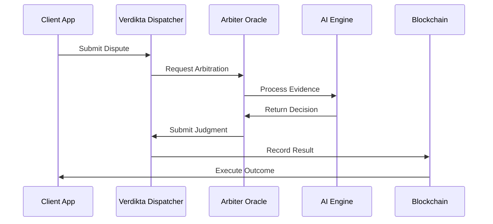

# Verdikta Overview

## System Architecture

Verdikta is built as a modular ecosystem with several key components working together to provide decentralized AI-powered dispute resolution.

### Core Components

1. **Verdikta Dispatcher** - Smart contract system for managing disputes and reputation
2. **Arbiter Oracles** - Chainlink-based nodes enhanced with AI capabilities
3. **AI Processing Engine** - Advanced language models for decision making
4. **Integration Layer** - SDKs and APIs for developers

### Supported Networks

- **Base Sepolia** (Testnet) - Currently active for testing
- **Ethereum Mainnet** (Coming Soon) - Planned deployment
- **Polygon** (Planned) - Future expansion

## How It Works

### Step-by-Step Process

1. **Dispute Creation**: Users submit disputes through smart contracts with evidence stored on IPFS
2. **Oracle Assignment**: System assigns qualified arbiters based on reputation and availability
3. **AI Processing**: Advanced AI models analyze evidence and arguments from multiple perspectives
4. **Decision Making**: Consensus mechanism ensures fair outcomes through weighted voting
5. **Settlement**: Results are recorded on-chain and trigger automatic execution

## Key Innovations

### Multi-Model AI Deliberation
- Multiple AI models from different providers analyze each dispute
- Weighted voting system based on model performance and specialization
- Bias reduction through diverse perspectives

### Reputation-Based Selection
- Arbiters build reputation over time based on decision quality
- Automatic selection of most qualified arbiters for each dispute type
- Economic incentives align with fair decision-making

### Blockchain Integration
- All decisions permanently recorded on-chain
- Automatic execution of outcomes through smart contracts
- Transparent and verifiable arbitration process

## Use Cases

### E-commerce Disputes
- Product quality disagreements
- Delivery and shipping issues
- Refund and return disputes

### Service Agreements
- Freelance work disputes
- Service quality issues
- Payment disagreements

### Insurance Claims
- Automated claim processing
- Fraud detection
- Coverage disputes

### Supply Chain
- Quality control disputes
- Delivery timing issues
- Contract compliance

## Benefits

### For Users
- **Fast Resolution**: Minutes instead of months
- **Low Cost**: Fraction of traditional arbitration fees
- **Fair Outcomes**: AI reduces human bias and emotions
- **Transparent Process**: All decisions publicly verifiable

### For Developers
- **Easy Integration**: Simple APIs and SDKs
- **Flexible Deployment**: Works with existing smart contracts
- **Scalable Solution**: Handles high volume of disputes
- **Customizable**: Tailor arbitration logic to specific needs

### For Node Operators
- **Earn Rewards**: Get paid for providing arbitration services
- **Build Reputation**: Develop standing in the ecosystem
- **Low Barriers**: Easy setup with automated tools
- **Passive Income**: Earn while providing valuable service

## Technical Specifications

### Performance Metrics
- **Resolution Time**: < 10 minutes average
- **Throughput**: 1000+ disputes per hour per arbiter
- **Availability**: 99.9% uptime target
- **Cost**: ~$1-5 per dispute (vs $100-1000 traditional)

### Security Features
- **Multi-signature validation**: Requires consensus from multiple arbiters
- **Cryptographic proofs**: All evidence cryptographically verified
- **Immutable records**: Blockchain ensures tamper-proof decisions
- **Access controls**: Role-based permissions and authentication

## Getting Started

Ready to integrate Verdikta into your application or become a node operator?

- **Developers**: Start with our [API documentation](../apps/)
- **Node Operators**: Follow our [installation guide](../verdikta-arbiter-node-installation-guide/)
- **Smart Contract Developers**: Review our [contract documentation](../verdikta-dispatcher-smart-contracts/) 